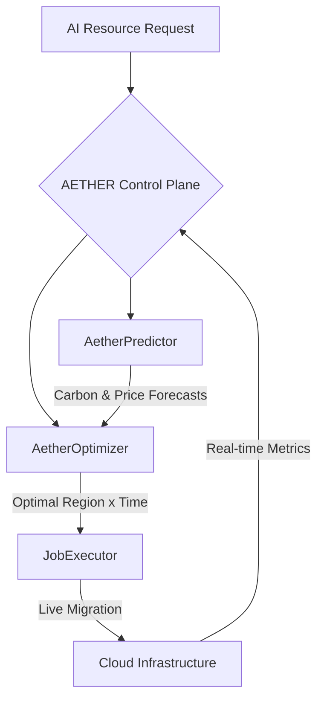

# EcoNode

## Autonomous Carbon-Cost Arbitrage Engine for AI Compute

EcoNode is an enterprise-grade control plane designed to integrate high-performance AI computation with environmental sustainability. The system autonomously routes AI training and inference workloads to regions and time windows that optimize for both cost-efficiency and carbon-minimal operations.

---

## Overview

EcoNode addresses the critical gap in spatial and temporal workload optimization for AI resources. By leveraging advanced spatiotemporal shifting, EcoNode enables organizations to reduce AI operational costs by up to 40% and carbon emissions by up to 60%, maintaining strict adherence to performance requirements and deadlines.

---

## System Architecture

EcoNode functions as an intelligent abstraction layer compatible with major cloud service providers, including AWS, GCP, and Azure.

### Workflow Diagram



### Core Components

*   **AetherPredictor**: Implements Prophet-based 24-hour forecasting for carbon intensity and spot pricing metrics.
*   **AetherOptimizer (SOAD)**: Utilizes a Spatiotemporal Online Allocation with Deadlines algorithm to balance operational costs and carbon footprint.
*   **JobExecutor**: A robust state machine capable of live migration and zero-progress-loss checkpointing.
*   **Next.js Dashboard**: A professional visualization suite providing real-time metrics and an interactive 3D global view of resource distribution.

---

## Feature Comparison

| Feature | IBM Envizi | Compute Gardener | Carbon Aware SDK | EcoNode |
| :--- | :---: | :---: | :---: | :---: |
| **Spatial Shifting** | No | No | Yes | **Yes** |
| **Temporal Shifting** | No | Yes | Yes | **Yes** |
| **Live Migration** | No | No | No | **Yes** |
| **Multi-cloud Native** | No | No | No | **Yes** |
| **Predictive AI Ops** | No | No | No | **Yes** |

---

## Deployment and Setup

### Prerequisites

*   Python 3.11 or higher
*   Node.js 20 or higher
*   Docker and Docker Compose (recommended for containerized deployment)

### Containerized Deployment (Docker)

To deploy the full EcoNode stack using Docker:

```bash
cp .env.example .env
docker compose up --build
```

*   **API Documentation**: `http://localhost:8000/docs`
*   **Dashboard**: `http://localhost:3000`

### Manual Installation

#### Backend (FastAPI)

1.  Navigate to the project root.
2.  Install the package in editable mode:
    ```bash
    pip install -e .
    ```
3.  Start the API server:
    ```bash
    uvicorn econode.api.main:app --port 8000 --reload
    ```

#### Frontend (Next.js)

1.  Navigate to the dashboard directory:
    ```bash
    cd dashboard_next
    ```
2.  Install dependencies:
    ```bash
    npm install
    ```
3.  Start the development server:
    ```bash
    npm run dev
    ```

---

## Research and Foundations

The EcoNode engine is built upon contemporary research in green computing and workload orchestration:

*   **CarbonFlex (2025)**: Strategies for thundering-herd mitigation and continuous learning models.
*   **CarbonClipper (2024)**: Competitive algorithms for deadline-aware workload management.
*   **CASPER (2024)**: Multi-objective scoring frameworks for latency and sustainability optimization.

---

## Contribution Guidelines

We welcome technical contributions. Please review our documentation on contributing and our code of conduct for further details.

---

## License

EcoNode is distributed under the Apache License 2.0. Refer to the LICENSE file for the full text.

---

*EcoNode Development Team*

